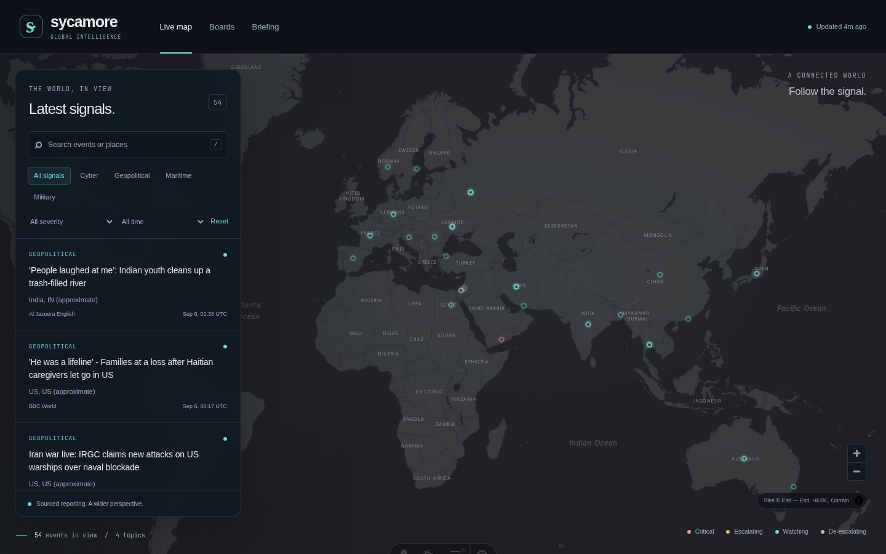
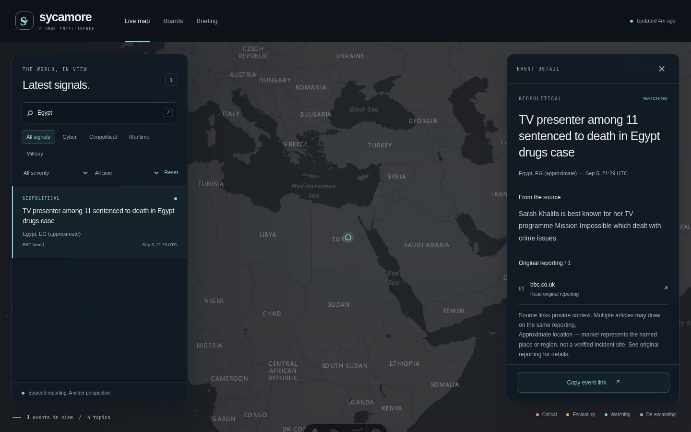

# Sycamore

Local-first global reporting dashboard for cyber, geopolitical, maritime, and military events. Explore sourced reporting through an interactive globe, a searchable feed, and time-based briefings.



<sub>Dashboard capture · September 5, 2026 · Earlier map interface; the current application uses a Cesium 3D globe. Reporting and timestamps reflect the captured snapshot.</sub>

## Capabilities

- **Geographic context:** Cesium globe with dark and satellite imagery, day/night shading, animated water, country and city selection, and optional aircraft, seismic, and Censys layers.
- **Sourced reporting:** Search and filter events by topic, severity, and time. Open source links, inspect event details, and share selections with their filters.
- **Boards and briefings:** Browse topic groups and coverage across 24-hour, 7-day, and 30-day windows.
- **Resilient ingestion:** Python RSS pipeline with optional GDELT, deduplication, schema validation, persistent event IDs, and atomic publication. Failed refreshes retain the last valid data.
- **Visible data health:** Updates every 60 seconds while the page is visible. Delayed, unavailable, empty, and explicitly fictional demo data have distinct states.

<details>
<summary>View event detail and source attribution</summary>



<sub>Earlier interface capture · September 5, 2026.</sub>

</details>

## Run locally

Requires Linux, Node 22.12+ (24.0+ on the Node 24 line), and Python 3.10+.

```sh
cd g3-astro
npm ci
npm run dev
```

Open **http://127.0.0.1:4321**. The port must be free. Setup regenerates Cesium assets and schema validators; map imagery requires access to Esri. The reporting feed remains usable if the map fails.

From `g3-ingest/`, refresh reporting with:

```sh
python3 -m sycamore_ingest.runner
```

Use `--snapshot-only` to convert existing data without fetching or advancing its successful-sync timestamp. For a clearly labeled fictional demo, run `PUBLIC_DEMO_MODE=true npm run dev` from `g3-astro/`; restart when changing modes.

## Verify

```sh
make verify
```

Runs formatting checks, Astro diagnostics, a production build, web tests, and Python ingestion tests. With the development server running, `npm run test:dev` from `g3-astro/` checks served JavaScript and dashboard/Boards responses. Automated tests do not certify WebGL appearance; browser review remains separate.

## Project structure

| Path | Purpose |
| --- | --- |
| [`g3-astro/`](g3-astro/) | Active website: Astro, TypeScript, Tailwind, and Cesium |
| [`g3-ingest/`](g3-ingest/README.md) | Standard-library Python ingestion, archive migrations, and publication |
| [`shared/`](shared/) | Shared JSON schemas and cross-language fixtures |
| [`00-admin/`](00-admin/), [`01-strategy/`](01-strategy/), [`02-design/`](02-design/) | Decisions, product direction, and design |
| [`03-architecture/`](03-architecture/), [`04-content/`](04-content/) | Architecture, implementation plans, and editorial guidance |
| [`performance/`](performance/), [`skills/`](skills/) | Performance evidence and project maintenance workflows |
| [`g1-prototype/`](g1-prototype/), [`g2-astro/`](g2-astro/) | Historical prototypes; excluded from active builds |

## Data and operation

`/data/snapshot.json` publishes events and health metadata together; `events.json` and `manifest.json` are compatibility mirrors. The feed retains up to 500 events and marks source checks delayed after 30 minutes. Classifications are heuristic, and approximate locations are not verified incident coordinates. Cloning the repository preserves dated coverage; it does not refresh reporting.

The site builds to static files. Production data changes require republishing the snapshot; static event pages require a rebuild. Dashboard links such as `/?event=123` can resolve newly ingested events before that rebuild. Local development serves current public data directly.

Private environment files, credentials, local databases, logs, dependencies, and generated output are excluded from Git. Optional Censys credentials stay in the ingestion environment. Installed services are configured separately; retain the active directory names because existing units reference them.

See the [ingestion guide](g3-ingest/README.md), [globe implementation](g3-astro/GLOBE.md), [performance notes](g3-astro/PERFORMANCE.md), and [security policy](00-admin/SECURITY_POLICY.md) for operational details. The Cloudflare header template is configuration for deployment, not evidence of a live deployment.
